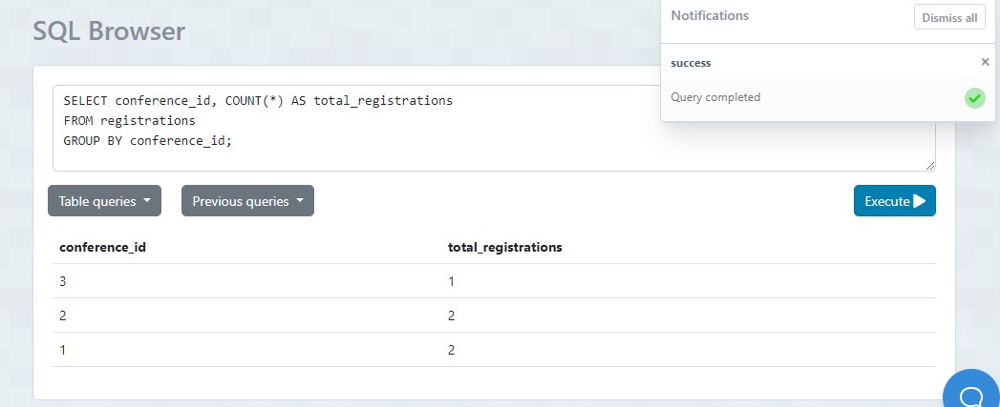

## 1. Listar los asistentes mayores a 30 anos al evento

- Sentencia: 

 SELECT COUNT(*) AS productos_sin_pais_de_origen
FROM product
WHERE country_of_origin IS NULL;

- Captura:

## 2. Contar el número de productos de una categoría específica.

- Sentencia: 

SELECT COUNT(*) AS numero_productos
FROM product

- Captura:

## 3. Contar el número de clientes en una ciudad específica.

- Sentencia: 
SELECT COUNT(*) AS numero_clientes
FROM customer_credit
WHERE "city" = 'Quito';

- Captura:

## 4. Contar el número de productos cuyo precio está dentro de un rango específico 
- Sentencia: 
SELECT COUNT(*) AS cantidad_productos
FROM product
WHERE price BETWEEN 300 AND 800;

- Captura:

## 5. Seleccionar clientes que viven en una ciudad específica y tienen un tipo de cliente específico
- Sentencia:
  SELECT *
FROM customer_credit
WHERE city = 'Quito' AND type_of_client = 'VIP';

- Captura:

## 6. Seleccionar productos que pertenecen a una categoría específica y cuyo precio está por encima de un valor específico
- Sentencia:
  SELECT *
FROM product
WHERE category = 'Mobile Phones' AND price > 500;

- Captura:

## 7. Seleccionar productos que fueron producidos en un año específico y en un país de origen específico
- Sentencia:
SELECT *
FROM product
WHERE year_of_production = 2023 AND country_of_origin = 'China';

- Captura:

## 8.Seleccionar clientes cuyo nombre completo comience con 'J'.
- Sentencia:
SELECT *
FROM customers
WHERE fullname LIKE 'J%';

- Captura:

## 9.Seleccionar clientes cuya ciudad contenga la letra 'a'
- Sentencia:
SELECT *
FROM customer_credit
WHERE city LIKE '%a%';

- Captura:

