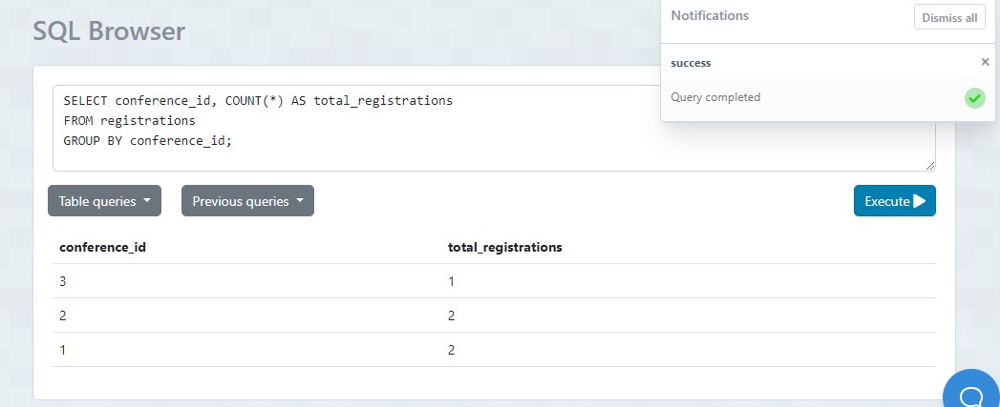

## 1. Obtener la edad promedio de los miembros:

- Sentencia: 
SELECT AVG(age) AS avg_age FROM members;

- Captura:

## 2. Obtener la edad mínima de los miembros:

- Sentencia: 
SELECT MIN(age) AS min_age FROM members;

- Captura:

## 3. Obtener el número total de registros asistidos:

- Sentencia: 
SELECT COUNT(*) AS total_registrations FROM registrations;
- Captura:

## 4. Obtener el número total de asistentes a todas las conferencias
- Sentencia: 
SELECT SUM(number_of_attendees) AS total_attendees FROM conferences;

- Captura:

## 5. Obtener el número total de eventos por cada ciudad:
- Sentencia: 
SELECT city, COUNT(*) AS total_events
FROM events
GROUP BY city;

- Captura:

## 6. Obtener el número de registros por cada miembro:
- Sentencia: 
SELECT member_id, COUNT(*) AS total_registrations
FROM registrations
GROUP BY member_id;

- Captura:

## 7. Obtener el número de registros por cada conferencia:
- Sentencia: 
SELECT conference_id, COUNT(*) AS total_registrations
FROM registrations
GROUP BY conference_id;

- Captura:

